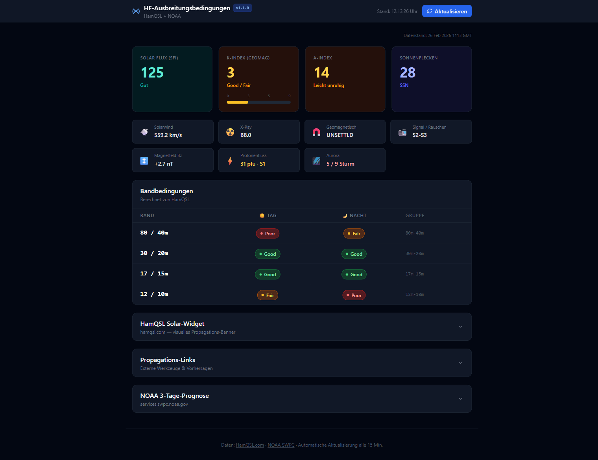

# Amateur Radio Propagation Info

**Version 1.3.0**

A lightweight, browser-based dashboard for real-time HF propagation conditions — solar indices, band conditions, and NOAA space weather forecast. All data is fetched directly in the browser; no server, no registration, no data collection.

**Developed by Fritz (DK9RC)**

[](https://dirschedlf.github.io/Amateur-Radio-Propagation-Info/)
[](https://github.com/DirschedlF/Amateur-Radio-Propagation-Info/releases/latest)


---

## Live Demo

**[→ dirschedlf.github.io/Amateur-Radio-Propagation-Info](https://dirschedlf.github.io/Amateur-Radio-Propagation-Info/)**

Or download the standalone HTML file from the [Releases](https://github.com/DirschedlF/Amateur-Radio-Propagation-Info/releases/latest) page and open it locally — no installation needed.

---



---

## Features

### Solar Indices
- **Solar Flux Index (SFI)** — with colour-coded quality rating (Sehr niedrig → Exzellent) and **trend arrow** (↑/↓) vs. previous fetch
- **K-Index** — geomagnetic activity with visual 0–9 gauge bar (Excellent → Storm G2+) and **trend arrow** (↑/↓)
- **A-Index** — daily geomagnetic index (Ruhig → Sturm)
- **Sunspot Number (SSN)**
- **Solar Wind** speed (km/s), **X-Ray** flux, **Geomagnetic field**, **Signal/Noise** level
- **Magnetfeld Bz** — interplanetary Bz component with storm-risk colour coding
- **Proton flux** — with NOAA S-scale level (S1–S4+)
- **Aurora activity** — 0–9 scale with activity/storm indicator

### Geomagnetic Storm Banner
A prominent dismissable banner appears when K-Index ≥ 5, showing the NOAA G-scale level (G1–G5) and a warning that HF propagation is disturbed. Automatically reappears on the next data refresh if conditions persist.

### Settings
A gear-icon modal in the header lets you store your **callsign** and **Maidenhead locator** locally (localStorage, no server). The locator is used to personalise the DXView HF Perspective propagation link.

### Band Conditions
Colour-coded **Good / Fair / Poor** table for 80m through 10m, split into **Day** and **Night** conditions — exactly as provided by HamQSL's calculated conditions engine.

| Band | Day | Night |
|------|-----|-------|
| 80 / 40m | 🟢 / 🟡 / 🔴 | 🟢 / 🟡 / 🔴 |
| 30 / 20m | … | … |
| 17 / 15m | … | … |
| 12 / 10m | … | … |

### HamQSL Solar Widget
The official HamQSL solar-terrestrial banner image — collapsible in the UI.

### Propagation Links
A collapsible panel with direct links to six external propagation tools:
[DR2W DX Propagation](https://propagation.dr2w.de/), [VOACAP HF Prediction](https://www.voacap.com/hf/), [Proppy](https://soundbytes.asia/proppy/area), [NOAA Space Weather Dashboard](https://www.spaceweather.gov/communities/space-weather-enthusiasts-dashboard), [QSL.net Propagation](https://dx.qsl.net/propagation/index.html), [DXView HF Perspective](https://hf.dxview.org/)

### DX News Calendar

Collapsible panel showing upcoming DX expeditions and contests from [dxnews.com](https://dxnews.com/) — loaded on demand.

### NOAA 3-Day Space Weather Forecast
Full text forecast from NOAA SWPC, collapsible in the UI.

### Auto-Refresh
Data refreshes automatically every **15 minutes**. Manual refresh always available.

### Standalone Distribution
Build a fully self-contained single HTML file — no dependencies, no internet connection required after opening (except to fetch live data).

---

## Data Sources

| Source | URL | Content |
|--------|-----|---------|
| **HamQSL.com** | `hamqsl.com/solarxml.php` | Solar indices + band conditions (XML) |
| **NOAA SWPC** | `services.swpc.noaa.gov` | 3-day space weather forecast (plain text) |

> **Note on CORS:** HamQSL does not send CORS headers. The app tries a direct fetch first; if blocked by the browser, it falls back automatically to a self-hosted Cloudflare Worker (`hamqsl-proxy.fritz-a2e.workers.dev`). Worker source is included under `cloudflare-worker/`.

---

## Getting Started

### Try the live demo

Open **[dirschedlf.github.io/Amateur-Radio-Propagation-Info](https://dirschedlf.github.io/Amateur-Radio-Propagation-Info/)** — deployed automatically from the `master` branch via GitHub Actions.

### Download the standalone file

Download `propagation-info-vX.X.X-standalone.html` from the [Releases](https://github.com/DirschedlF/Amateur-Radio-Propagation-Info/releases/latest) page and open it directly in any modern browser — no installation, no server needed. A new release file is created automatically when a version tag is pushed.

### Run locally (development)

```bash
git clone https://github.com/DirschedlF/Amateur-Radio-Propagation-Info.git
cd Amateur-Radio-Propagation-Info
npm install
npm run dev
```

Open [http://localhost:5173](http://localhost:5173).

### Build for production

```bash
npm run build            # → dist/
npm run build:standalone # → dist-standalone/index.html  (single self-contained file)
```

---

## Tech Stack

- [React 18](https://react.dev/) — UI framework
- [Vite](https://vitejs.dev/) — build tool
- [Tailwind CSS](https://tailwindcss.com/) — styling
- [Lucide React](https://lucide.dev/) — icons
- [vite-plugin-singlefile](https://github.com/richardtallent/vite-plugin-singlefile) — standalone HTML build

---

## Related Projects

- [Amateur Radio DXCC Analyzer Pro](https://github.com/DirschedlF/Amateur-Radio-DXCC-Analyzer-Pro) — ADIF logbook analyzer for DXCC tracking

---

## License

MIT — see [LICENSE](LICENSE)
